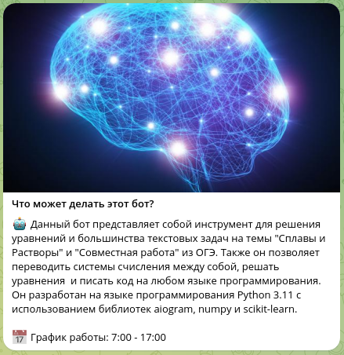
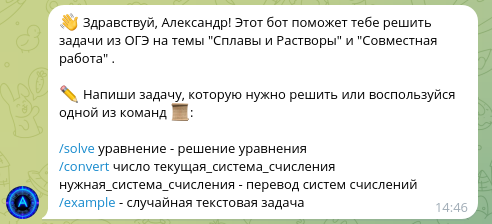
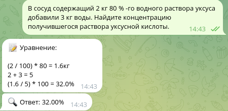
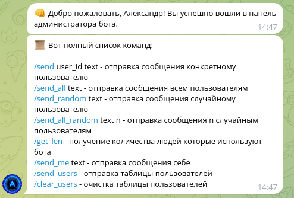

### ALPHA-01 - это телеграм-бот для решения задач из второй части ОГЭ типа 21. Пока что, он может решать задачи только на темы "Сплавы и Растворы" и "Совместная работа". В него зашиты несколько нейронных сетей, которые классифицируют задачи для дальнейшего решения.

## Начало работы:

## Пример работы:

## Панель администратора:
